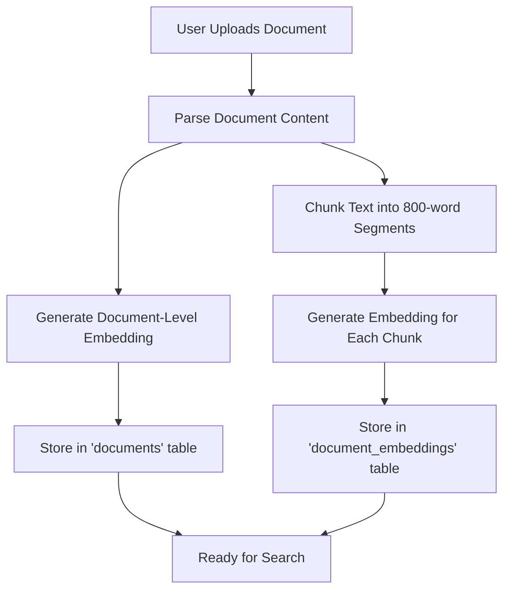
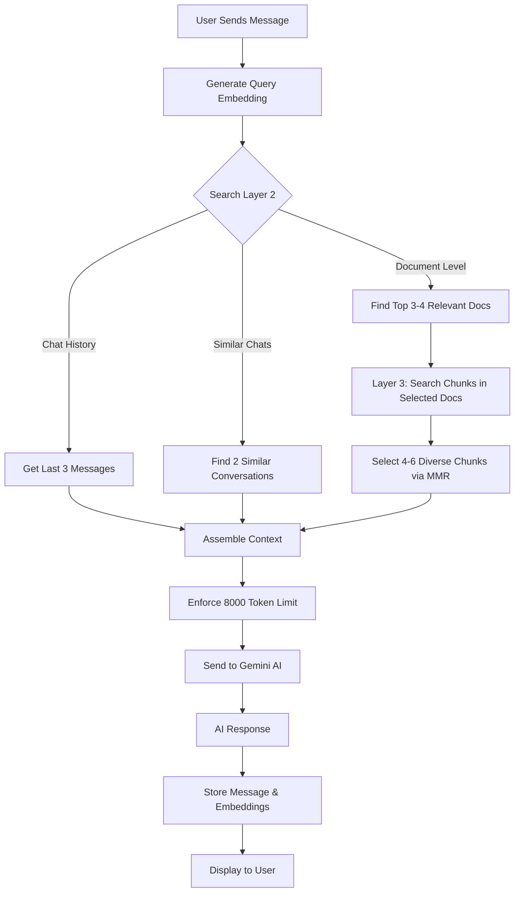

# Vector Mind AI - Advanced AI Study Platform

<div align="center">


**An intelligent AI-powered study platform with advanced RAG (Retrieval-Augmented Generation) capabilities**

🌐 **[Visit vectormind.site to start learning](https://vectormind.site)**

[Features](#-features) • [Architecture](#-architecture) • [How It Works](#-how-it-works) • [Tech Stack](#-tech-stack)

</div>

---

## 📚 Overview

Vector Mind AI is a modern, full-stack AI study platform that leverages cutting-edge technologies to provide an intelligent learning experience. The platform uses a sophisticated **3-layer RAG architecture** to combine conversational AI with document-based learning, enabling students to interact with their study materials through natural language.

**👉 Start using the platform at [vectormind.site](https://vectormind.site)**

### 🎯 Key Capabilities

- **Multimodal Input**: Send text with image, video, audio, and document attachments (up to 25MB)
- **Intelligent Document Processing**: Upload and parse multiple document formats (DOCX, PPTX, TXT, MD)
- **Smart AI Model Selection**: Automatically chooses optimal free models based on query complexity and context
- **Vector Search**: Advanced semantic search using pgvector embeddings (1536 dimensions)
- **Real-time Voice Calls**: AI-powered voice conversations with speech-to-text and text-to-speech
- **Image Generation**: Create images from text descriptions
- **User Authentication**: Secure authentication with Clerk
- **Dark Mode Support**: Beautiful UI with light/dark themes

---

## 🏗️ Architecture

### 3-Layer RAG (Retrieval-Augmented Generation) System

Vector Mind AI implements a sophisticated **layered retrieval architecture** to efficiently search through large document collections while maintaining high accuracy:

```
┌─────────────────────────────────────────────────────────────┐
│                     USER QUERY                               │
│              "What is photosynthesis?"                       │
└──────────────────────┬──────────────────────────────────────┘
                       │
                       ▼
    ┌──────────────────────────────────────────────────┐
    │          LAYER 1: QUERY EMBEDDING                 │
    │  • Convert query to 1536-dim vector              │
    │  • Uses Google's text-embedding-004              │
    └──────────────────┬───────────────────────────────┘
                       │
          ┌────────────┴────────────┐
          │                         │
          ▼                         ▼
┌─────────────────────┐   ┌─────────────────────┐
│  LAYER 2: DOCUMENT  │   │  LAYER 2: CHAT      │
│      ROUTING        │   │    HISTORY          │
│                     │   │                     │
│ • Search doc-level  │   │ • Recent messages   │
│   embeddings        │   │ • Similar convos    │
│ • Find top 3-4 docs │   │ • Context window    │
│ • Hybrid search     │   │                     │
│   (vector + text)   │   │                     │
└──────┬──────────────┘   └──────┬──────────────┘
       │                         │
       └──────────┬──────────────┘
                  │
                  ▼
    ┌────────────────────────────────────────┐
    │     LAYER 3: CHUNK RETRIEVAL           │
    │                                        │
    │ • Search chunks ONLY in selected docs │
    │ • Retrieve 4-6 most relevant chunks   │
    │ • MMR diversity selection             │
    │ • Hybrid search (vector + keyword)    │
    └──────────────────┬─────────────────────┘
                       │
                       ▼
    ┌────────────────────────────────────────┐
    │      CONTEXT ASSEMBLY                  │
    │                                        │
    │ 1. Recent conversation (3 messages)   │
    │ 2. Similar conversations (2 relevant) │
    │ 3. Document chunks (4-6 passages)     │
    │ 4. Token limit enforcement (8000)     │
    └──────────────────┬─────────────────────┘
                       │
                       ▼
    ┌────────────────────────────────────────┐
    │     AI RESPONSE GENERATION             │
    │     (OpenRouter Free Models)           │
    │                                        │
    │ • Smart model selection:               │
    │   - With context: Hermes-3 (405B)     │
    │   - Short queries: Llama-3.3 (70B)    │
    │   - Complex queries: Hermes-3 (405B)  │
    │ • Automatic fallback chain            │
    │ • Response continuation for long text │
    │ • Grounded in provided context        │
    │ • Citations from documents            │
    └────────────────────────────────────────┘
```

### Why 3 Layers?

1. **Layer 1 (Embedding)**: Converts natural language queries into mathematical vectors that capture semantic meaning
2. **Layer 2 (Document Routing)**: Quickly identifies which documents are relevant (fast filtering)
3. **Layer 3 (Chunk Retrieval)**: Finds specific passages within selected documents (precise extraction)

This architecture prevents:
- ❌ **Token explosion**: Avoids sending entire documents to the AI
- ❌ **Context overflow**: Limits context to ~8000 tokens (well below 131k limit)
- ❌ **Irrelevant results**: Focuses search on promising documents first
- ❌ **Redundancy**: Uses MMR (Maximal Marginal Relevance) to select diverse chunks

---

## 🔄 How Chat & Documents Work Together

### The Document Upload Flow



**Step-by-Step:**

1. **Upload**: User uploads DOCX, PPTX, TXT, or MD file through the Documents page
2. **Parsing**: Document is parsed into plain text using specialized parsers:
   - DOCX: Mammoth.js extracts formatted text
   - PPTX: JSZip + XML parsing for slides
   - TXT/MD: Direct text extraction
3. **Indexing**:
   - **Document-level**: Title + first 4000 chars → 1536-dim embedding → stored in `documents.embedding`
   - **Chunk-level**: Full content split into ~800-word chunks → each chunk embedded → stored in `document_embeddings`
4. **Storage**: Embeddings stored as JSON arrays in Supabase (pgvector extension)

### The Chat Query Flow



**Step-by-Step:**

1. **Query Processing**:
   - User's message is embedded into 1536-dimensional vector
   - Query is sanitized for hybrid text search

2. **Context Retrieval** (Parallel):
   - **Recent History**: Last 3 messages from current chat
   - **Similar Conversations**: 2 most relevant messages from other chats
   - **Document Routing**: Top 3-4 documents matching query (hybrid vector + text search)
   - **Chunk Retrieval**: 4-6 chunks from selected documents (MMR diversity)

3. **Context Assembly**:
   ```
   === RECENT CONVERSATION ===
   Message 1: User: ... | Assistant: ...
   Message 2: User: ... | Assistant: ...
   
   === SIMILAR CONVERSATIONS ===
   1. [user] (87.3% similar): Previous related question
   2. [assistant] (82.1% similar): Previous answer
   
   === RELEVANT DOCUMENTS ===
   1. (91.5% relevant) | Biology Notes | Chapter 3: Photosynthesis...
   2. (88.7% relevant) | Study Guide | The process involves...
   ```

4. **AI Generation**:
   - Edge Function analyzes query length and context presence
   - Model selection logic:
     - **Has context**: Uses Hermes-3 Llama-3.1-405B (best accuracy for document-based answers)
     - **Short query (≤20 words)**: Uses Llama-3.3-70B (fast response)
     - **Complex query (>20 words)**: Uses Hermes-3 Llama-3.1-405B (better reasoning)
   - Automatic fallback to 5 alternative free models if primary fails
   - Response continuation mechanism for answers cut off by token limits
   - All responses delivered via Supabase Edge Function (server-side OpenRouter calls)

5. **Storage**:
   - User message and AI response saved to `chat_messages`
   - Both embedded and stored in `chat_embeddings` for future searches

---

## 💾 Database Schema

### Core Tables

```sql
-- User profiles (Clerk authentication)
users
  ├── id (text, primary key - Clerk user ID)
  ├── email (text)
  ├── role (text: 'user' | 'admin')
  └── created_at (timestamp)

-- Chat sessions
chats
  ├── id (uuid, primary key)
  ├── user_id (text, foreign key → users)
  ├── title (text)
  └── created_at (timestamp)

-- Chat messages
chat_messages
  ├── id (uuid, primary key)
  ├── chat_id (uuid, foreign key → chats)
  ├── user_id (text, foreign key → users)
  ├── message (text) -- User's message
  ├── response (text) -- AI's response
  └── created_at (timestamp)

-- Documents
documents
  ├── id (uuid, primary key)
  ├── user_id (text, foreign key → users)
  ├── title (text)
  ├── content (text)
  ├── type (text: 'file' | 'link')
  ├── url (text, nullable)
  ├── embedding (vector(1536)) -- Document-level embedding
  └── created_at (timestamp)
```

### Vector Search Tables

```sql
-- Chat message embeddings
chat_embeddings
  ├── id (uuid, primary key)
  ├── chat_id (uuid, foreign key → chats)
  ├── message_id (uuid, foreign key → chat_messages)
  ├── user_id (text, foreign key → users)
  ├── content (text)
  ├── embedding (vector(1536)) -- Message embedding
  ├── message_type (text: 'user' | 'assistant')
  └── created_at (timestamp)

-- Document chunk embeddings
document_embeddings
  ├── id (uuid, primary key)
  ├── document_id (uuid, foreign key → documents)
  ├── user_id (text, foreign key → users)
  ├── content_chunk (text) -- ~800 word segment
  ├── chunk_index (integer) -- Position in document
  ├── embedding (vector(1536)) -- Chunk embedding
  └── created_at (timestamp)
```

### Key Database Functions

- `search_similar_documents_index_hybrid()` - Layer 2: Find relevant documents (vector + text)
- `search_similar_document_chunks_hybrid_filtered()` - Layer 3: Find chunks in selected docs
- `search_similar_chat_messages()` - Find similar conversations

---

## 🎨 Features in Detail

### 1. Smart Chat Interface

- **Multimodal input**: Text + image, video, audio, PDF attachments (max 25MB each)
- **Drag & drop attachments**: Visual preview with remove option
- **Smart model selection**: 
  - Document-based queries → Hermes-3 405B (accuracy)
  - Quick questions → Llama-3.3 70B (speed)
  - Automatic fallback chain for reliability
- **Response continuation**: Handles long answers cut off by token limits
- **Multi-turn conversations**: Maintains context across messages
- **Markdown support**: Rich text formatting in responses
- **Code highlighting**: Syntax highlighting for code blocks
- **Citation tracking**: Shows which documents were used
- **Chat management**: Create, rename, delete conversations
- **Sidebar navigation**: Easy access to chat history
- **Suggested actions**: Quick-start prompts for new chats

### 2. Document Management

- **Multiple formats**: DOCX, PPTX, TXT, MD support
- **Drag & drop**: Intuitive file upload
- **Link storage**: Save web resources with titles
- **Automatic indexing**: Background embedding generation
- **Delete protection**: Clean up embeddings on deletion
- **Visual feedback**: Loading states and error handling

### 3. Voice Call System

- **Real-time STT**: Speech-to-Text using Groq Whisper
- **Natural TTS**: Text-to-Speech with Groq
- **State machine**: Reliable IDLE → LISTENING → THINKING → SPEAKING flow
- **Audio processing**: WebRTC-based audio capture and playback
- **Visual feedback**: Animated Siri-style wave visualizer

### 4. Image Generation

- AI-powered image creation from text prompts
- Integration with image generation APIs

---

## 🛠️ Tech Stack

### Frontend
- **React 18.3** - UI library
- **TypeScript 5.5** - Type safety
- **Vite** - Build tool & dev server
- **TailwindCSS** - Utility-first CSS
- **Framer Motion** - Animations
- **React Router** - Navigation
- **Radix UI** - Accessible components
- **React Markdown** - Markdown rendering
- **React Syntax Highlighter** - Code highlighting

### Backend & Database
- **Supabase** - Backend-as-a-Service
  - PostgreSQL database
  - Real-time subscriptions
  - Edge Functions (Deno)
  - Row-level security (RLS)
- **pgvector** - Vector similarity search

### AI & ML
- **OpenRouter** - Multi-model AI gateway (free tier models)
  - **Primary Models**:
    - `nousresearch/hermes-3-llama-3.1-405b:free` - Best reasoning (used with context)
    - `meta-llama/llama-3.3-70b-instruct:free` - Fast responses (short queries)
  - **Fallback Models**:
    - `deepseek/deepseek-r1-0528:free` - DeepSeek reasoning
    - `openai/gpt-oss-120b:free` - GPT-style responses
    - `qwen/qwen3-coder:free` - Code-focused queries
  - **Embeddings**:
    - `openai/text-embedding-3-small` - Vector embeddings (1536 dims)
- **Groq Whisper** - Speech-to-Text
- **Groq TTS** - Text-to-Speech
- **Smart Model Selection** - Word count & context-aware routing

### Authentication
- **Clerk** - User authentication & management
- **JWT** - Secure session tokens

### Document Processing
- **Mammoth.js** - DOCX parsing
- **JSZip** - PPTX extraction
- **Native parsers** - TXT/MD

---

## 📂 Project Structure

```
AI-STUDY/
├── src/
│   ├── api/                    # API utilities
│   ├── components/             # React components
│   │   ├── ui/                # Reusable UI components
│   │   ├── ChatMessage.tsx    # Chat message display
│   │   ├── Navbar.tsx         # Navigation bar
│   │   └── UserProfile.tsx    # User profile widget
│   ├── contexts/              # React contexts
│   │   └── ClerkAuthContext.tsx  # Auth state management
│   ├── lib/                   # Core libraries
│   │   ├── gemini.ts         # AI chat integration
│   │   ├── vectorSearch.ts   # RAG implementation
│   │   ├── supabaseClerk.ts  # Supabase + Clerk bridge
│   │   ├── documentParser.ts # Document processing
│   │   └── utils.ts          # Utility functions
│   ├── pages/                 # Page components
│   │   ├── Chat.tsx          # Chat interface
│   │   ├── Documents.tsx     # Document management
│   │   ├── Livecall.tsx      # Voice call interface
│   │   ├── ImageGen.tsx      # Image generation
│   │   └── Landing.tsx       # Landing page
│   ├── services/              # External service integrations
│   │   ├── embeddings.ts     # Embedding generation
│   │   ├── groqSTT.ts        # Speech-to-text
│   │   ├── groqTTS.ts        # Text-to-speech
│   │   └── gemini.ts         # Gemini AI service
│   ├── types/                 # TypeScript type definitions
│   │   └── embeddings.ts     # Vector search types
│   └── App.tsx                # Root component
├── supabase/
│   ├── functions/             # Edge Functions
│   │   ├── chat-completion/  # AI chat endpoint
│   │   ├── generate-embedding/  # Embedding endpoint
│   │   └── clerk-webhook/    # Auth webhook
│   └── migrations/            # Database migrations
│       ├── 20250128000000_enable_vector_embeddings.sql
│       └── [other migrations...]
├── docs/
│   └── RAG_LAYERS_GUIDE.md   # Detailed RAG documentation
├── public/                    # Static assets
├── index.html                 # HTML entry point
├── vite.config.ts            # Vite configuration
├── tailwind.config.js        # Tailwind configuration
├── tsconfig.json             # TypeScript configuration
└── package.json              # Dependencies & scripts
```

---

## 🔒 Security

- **Authentication**: Clerk-based auth with secure JWT tokens
- **Row-Level Security (RLS)**: Supabase policies ensure users only access their data
- **API Key Protection**: OpenRouter API key stored server-side in Edge Functions (never exposed to client)
- **File Upload Security**: 
  - 25MB file size limit
  - Client-side validation (mime types: image/*, video/*, audio/*, .pdf)
  - Object URL cleanup to prevent memory leaks
- **CORS Configuration**: Proper origin restrictions
- **Input Sanitization**: Query validation to prevent SQL/prompt injection
- **Server-side AI calls**: All OpenRouter requests through Supabase Edge Functions

---

## 🎯 Performance Optimizations

1. **Vector Search**:
   - IVFFlat indexes for fast approximate nearest neighbor search
   - Hybrid search combines vector + text for better accuracy
   - MMR diversity to reduce redundant results

2. **Context Management**:
   - Token counting to prevent overflow (8000 token limit)
   - Truncation strategies for large contexts
   - Parallel fetching of context sources

3. **Database**:
   - Indexed foreign keys for fast joins
   - Batch embedding inserts
   - Efficient cleanup of old embeddings

4. **Frontend**:
   - Code splitting with React.lazy
   - Optimized re-renders with React.memo
   - Debounced search inputs

---

## 📊 Usage Examples

### Example 1: Asking About Uploaded Documents

**User uploads**: "Biology Textbook - Chapter 3.docx"

**User asks**: "What are the main stages of photosynthesis?"

**System**:
1. Embeds query
2. Finds "Biology Textbook" doc (Layer 2)
3. Retrieves 4 relevant chunks from chapter 3 (Layer 3)
4. Detects context present → selects Hermes-3 Llama-3.1-405B (best accuracy)
5. AI responds with citations: 
   > "Based on your Biology Textbook (91.5% relevant), photosynthesis has two main stages:
   > 1. Light-dependent reactions...
   > 2. Light-independent reactions (Calvin cycle)..."

### Example 2: Following Up on Previous Chat

**Previous chat**: User learned about Python classes

**User asks**: "How do I inherit from the class we discussed?"

**System**:
1. Retrieves last 3 messages (Layer 2 - Chat History)
2. Finds similar conversation about classes (Layer 2 - Similar Chats)
3. Query is 12 words → selects Llama-3.3-70B (fast response)
4. AI responds with context-aware answer referencing previous discussion

---

## � Contact

For support or inquiries:
- Email: studyai.platform@gmail.com
- Website: [vectormind.site](https://vectormind.site)

---

## 🙏 Powered By

- **OpenRouter Free Tier** - AI gateway providing:
  - Nous Research Hermes-3 Llama-3.1-405B (primary reasoning)
  - Meta Llama-3.3-70B-Instruct (fast responses)
  - DeepSeek R1, GPT-OSS-120B, Qwen3 Coder (fallbacks)
  - OpenAI text-embedding-3-small (vector embeddings - 1536 dims)
- **Supabase** - Backend platform, database, and Edge Functions
- **Clerk** - Authentication infrastructure
- **Groq** - Ultra-fast speech processing (Whisper STT + TTS)
- **pgvector** - PostgreSQL extension for vector similarity search

---

<div align="center">

**© 2026 Vector Mind AI. All rights reserved.**

Visit [vectormind.site](https://vectormind.site) to start learning with AI

</div>
